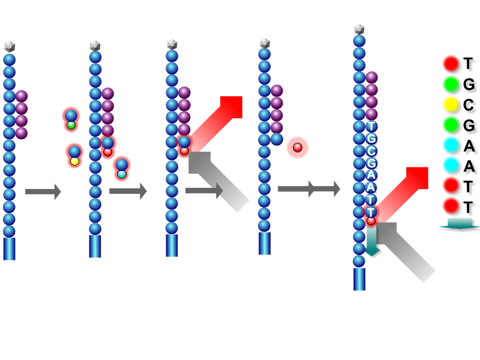

[ADAM](https://www.github.com/bigdatagenomics/adam) is an open-source library and command line
toolkit for exploring genomic data. In this chapter, we will use ADAM to explore a short portion
of a human genome. ADAM is built on Spark and also provides an interactive shell. Our first two
exercises will use the ADAM command line tools, and we'll use the ADAM shell for the last two
exercises.

In this exercise, we'll use a several hundred base pair long fragment of a human genome.
Conceptually, the human genome is divided up into 23 different chromosomes (22 "autosomal"
chromosomes, and the X/Y sex chromosomes). Each person has two copies of each chromosome; one
inherited from your mother, and one from your father. Each chromosome is a long string made out
of the letters A, C, G, and T. The chromosomes vary in length from 300 million bases on chromosome 1
down to 50 million bases on the Y chromosome.

When we sequence a genome, we get the data back as _short reads_. These short reads are 100-250
letter long _samples_ of your genome. No sequencer yet can read a whole chromosome at once. Instead,
we cut the DNA into fragments, and sequence the fragments. The sequencers themselves are "massively
parallel"; in parallel, we attach a dye to the current base on each read. We then take a picture of
the dyes, strip the current base, and repeat until we are out of bases. This process is called
_sequencing by synthesis_.

The Human Genome Project assembled the structure of the human genome, which we refer to as the _human
reference genome_. On average, the genome of two humans is different only at one in every 1000 bases.
Since humans are so similar, to process the reads, we _align_ each read to a location on the human
genome. Once the reads are aligned, we can identify locations where the genome we are looking at is
different from the reference genome. We call these locations _variants_.

## The ADAM Data Format

Current formats for storing genomic data rely on a hand-maintained specification. This makes it
difficult to make libraries that are consistent across platforms. In ADAM, we chose to define an
explicit schema for each datatype, which is implemented using [Avro](http://avro.apache.org). We
then store the data on disk using the [Parquet](http://parquet.incubator.apache.org) columnar
storage format.

The reads we will process are currently stored in the Sequence Alignment/Mapping (SAM) format, which
is a text based format. The ADAM command line understands both SAM and ADAM, but, let's convert the
data into the ADAM format by running the following command:

<pre class="prettyprint lang-bsh">
adam/bin/adam-submit transform NA12878.sam NA12878.adam
</pre>

Once this command finishes, let's compare the size of the two files.

<pre class="prettyprint lang-bsh">
ls -alh NA12878.sam
du -h NA12878.adam
</pre>

Here, ADAM is about 50% smaller! While this is a toy example, SAM has a binary, compressed companion
called BAM. In practice, ADAM is approximately 20% smaller than compressed BAM files. This is due to
Parquet. Since Parquet stores each column individually, it can apply column specific compression
techniques like dictionary encoding for columns with low cardinality, or run length encoding for
highly repetitive columns. Parquet allows us to check the size of each column; we can do this by
running:

<pre class="prettyprint lang-bsh">
export CLASSPATH=$(./adam/bin/compute-adam-classpath.sh)
java parquet.hadoop.PrintFooter NA12878.adam
</pre>

Three columns make up about 75% of the size of the file on disk. These columns store information
about the _quality_ of each base in the read. While Parquet is able to compress most fields well,
the quality scores are noisy and compress poorly without using lossy compression.

## Genome Visualization

One of the key metrics that we look at when processing genomes is the number of reads that cover
each location, or _coverage_. We can take a look at this using ADAM's visualization toolkit. First,
run the following command:

<pre class="prettyprint lang-bsh">
adam/bin/adam-submit viz NA12878.adam 20
</pre>

This will load up the reads from chromosome 20 in ADAM's visualization tool. Now, go to your web
browser, and navigate to `localhost:8080/freq`. This will show the coverage per position on the
chromosome. Initially, the screen will be blank; this is because the reads we have are not from the
start of the chromosome, but rather are from the middle. Enter the coordinates `224500` and `225500`
into the browser.

We can also visualize the exact reads by navigating to `localhost:8080/reads`.

## Interactive Analysis

1. *_k_-mer Analysis*

2. *Variant Calling*